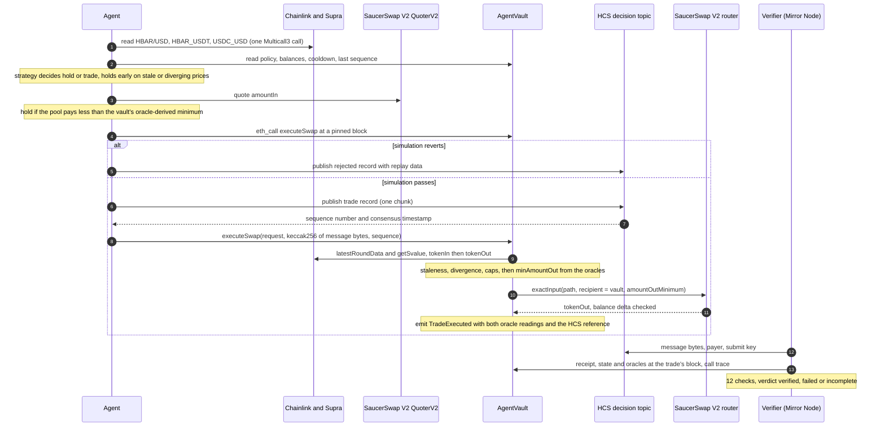

# Autonr

**Let an AI agent trade without trusting it.**

An agent that holds keys and decides its own prices is a single point of failure. It can hallucinate a price, be
prompt-injected or leak its key, and afterwards you only have its own word for why it traded. Autonr is a Scaffold-HBAR
template that splits the job so no part needs to be trusted:

- **The agent decides whether to trade.** It sends only `tokenIn`, `tokenOut`, `poolFee` and `amountIn`, and the
  fee tier must be one the owner approved for that pair. It never sends a price or a minimum output, and it cannot withdraw.
- **Two oracle networks decide at what price.** `AgentVault`, a contract on Hedera, prices each leg with Chainlink,
  refuses the trade unless Supra agrees within a set tolerance, works out the minimum output itself, enforces the
  owner's caps and only then swaps on SaucerSwap V2.
- **The reasoning comes before the trade, and anyone can check it.** The agent publishes its decision to a Hedera
  Consensus Service (HCS) topic before it trades. The vault refuses any trade that does not cite that message's hash
  and a newer sequence number. A verifier then checks each trade using only public Mirror Node data.

Out of the box you get a Foundry contract, a TypeScript agent with three strategies (deterministic rebalance, an LLM
through the Vercel AI SDK, or manual), a verifier, and a Next.js dashboard. The dashboard has a proof page per trade and
a lab where you tamper with the evidence and watch the matching check fail.

## Verified on Hedera testnet

Everything below is live on testnet and is also the template's built-in reference deployment: a fresh scaffold's
dashboard shows it with no keys configured.

| What | Evidence |
| ---- | -------- |
| AgentVault | [`0x037b24d5…a472`](https://hashscan.io/testnet/contract/0x037b24d59836e1C0cb9Fe571f004409D81eba472) |
| Agent account (only submit key on the topic) | [`0.0.10821548`](https://hashscan.io/testnet/account/0.0.10821548) |
| HCS decision topic | [`0.0.10821549`](https://hashscan.io/testnet/topic/0.0.10821549) |
| Decision record published before the trade | [message 1](https://hashscan.io/testnet/topic/0.0.10821549/message/1) |
| Executed trade (`TradeExecuted`, 47.96 WHBAR sold through SaucerSwap V2) | [`0x61430295…4158`](https://hashscan.io/testnet/transaction/0x61430295e8342246ec6e432921017c0a49fa961fc814ded1e7c2065d9d514158) |
| Independent verification | `yarn verify -- 0x61430295e8342246ec6e432921017c0a49fa961fc814ded1e7c2065d9d514158` returns `VERIFIED: 12 checks passed` (decision published 5.16 s before the trade) |
| Refused buy (the testnet pool prices HBAR about 20x above the oracles) | [message 3](https://hashscan.io/testnet/topic/0.0.10821549/message/3): the pool would pay 1.00 WHBAR where the vault's oracle-derived minimum is 18.61, so the agent held instead of trading |
| Vault rules enforced on-chain | `yarn agent:red-team`: all six rule-breaking calls refused with their expected custom errors |

## Quickstart

```bash
npx create-scaffold-hbar@latest my-autonr --template NetLayerLabs/Autonr
cd my-autonr
```

The `npm create` form also works, but there every flag written before a bare `--` goes to the package manager, not
to the scaffold CLI, so `--template` has to come after it:

```bash
npm create scaffold-hbar@latest my-autonr -- --template NetLayerLabs/Autonr
```

The CLI asks which package manager to use. To skip the question, add `--package-manager npm` or
`--package-manager yarn`. With `--yes` the CLI takes the template's default (npm), but it reads that default through
GitHub's anonymous API; if that call fails or is rate limited it falls back to Yarn and stops when Yarn is not
installed, so naming the package manager is the safe choice in scripts:

```bash
npx create-scaffold-hbar@latest my-autonr --template NetLayerLabs/Autonr --package-manager npm --yes
```

Commands in this file are written as `yarn <script>`, with flags after
`--` (`yarn verify -- <tx>`). If you scaffold with npm, the CLI rewrites them to the `npm run <script> -- <flags>` form.

### Prerequisites

| Tool        | Version                     | Why                                                                                           |
| ----------- | --------------------------- | --------------------------------------------------------------------------------------------- |
| Node.js     | >= 20.18.3                  | Agent, dashboard and scaffold scripts.                                                        |
| Foundry     | below 1.8: `foundryup -i v1.7.1` | Forge 1.8 and later send block parameters that the Hedera JSON-RPC relay rejects, so deploys and fork tests fail. |
| git         | with `user.name` and `user.email` set | The scaffold CLI makes the first commit and installs the contract libraries as submodules. |
| make        | any                         | `yarn deploy` runs the Foundry Makefile.                                                      |
| Yarn        | only if you pick it         | Node 25 and later no longer bundle corepack, so install it yourself: `npm install -g yarn`.   |
| curl        | any                         | Only for the fork tests (`yarn foundry:test:fork`).                                           |

## Try it with no keys

```bash
yarn foundry:test      # 100 unit, fuzz and invariant tests for AgentVault, offline, about 1 s
yarn agent:test        # agent, SaucerSwap and verifier tests (vitest)
yarn start             # dashboard on http://localhost:3000
yarn market:inspect    # SaucerSwap pool vs oracles: would the vault accept a $1 buy and a $1 sell right now?
```

With no env file, the dashboard reads live Chainlink and Supra prices from testnet. Every other panel shows the exact
command that would fill it. `yarn market:inspect` reads the oracles and the SaucerSwap pool, needs no keys and sends
nothing.

`yarn agent:dry-run` asks the agent what it would do right now. It reads the oracles, the vault and the pool, runs the
strategy and simulates the trade against the vault, but publishes and sends nothing. The simulation runs as the agent,
so the dry run needs a vault and an agent: step 5 below.

## Run your own agent on testnet

1. **Create an ECDSA testnet account** at [portal.hedera.com](https://portal.hedera.com) and keep its account ID
   (`0.0.x`) and HEX-encoded private key. Choose ECDSA, not ED25519: only ECDSA keys can sign EVM transactions. This
   account becomes the vault owner (the "operator").
2. **Import the key** into a Foundry keystore. Name the keystore, paste the hex private key and set a password:
   ```bash
   yarn account:import
   ```
3. **Deploy the vault**:
   ```bash
   yarn deploy:testnet
   ```
   This deploys `AgentVault` with the default policy: $25 per trade, $100 per UTC day, one trade a minute, 3% slippage,
   1.5% Chainlink/Supra divergence and prices up to one day old on testnet. It then allows WHBAR (Chainlink HBAR/USD,
   cross-checked by Supra) and USDC (Supra) and associates the vault with both HTS tokens. The vault address is written
   to `packages/foundry/deployments/296.json`.
4. **Write `packages/agent/.env`** (start from `packages/agent/.env.example`):
   ```bash
   cp packages/agent/.env.example packages/agent/.env
   ```
   Set `OPERATOR_ACCOUNT_ID` and `OPERATOR_PRIVATE_KEY` (the same account and key as step 1; raw hex or the
   Portal's DER string both work), and `AUTONR_VAULT_ADDRESS`.
5. **Create the agent and its decision topic**:
   ```bash
   yarn agent:setup
   ```
   Using the operator, setup creates a new ECDSA agent account funded with 25 HBAR, and an HCS topic whose only submit
   key is the agent's key. It then calls `setAgent` and `setDecisionTopic` on the vault and writes `AGENT_ACCOUNT_ID`,
   `AGENT_PRIVATE_KEY` and `AUTONR_TOPIC_ID` to the env file. It is idempotent: run it again and it only does what is
   missing.
6. **Fund the vault**. This wraps HBAR into WHBAR and transfers it to the vault (about $10 at $0.10 per HBAR). Add
   `--dry-run` to see the plan first:
   ```bash
   yarn vault:fund -- --hbar 100
   ```
7. **Check everything**. Each check prints PASS, WARN or FAIL with a one-line fix. A WARN on the SaucerSwap pool is
   expected on testnet (see [Testnet reality](#testnet-reality)):
   ```bash
   yarn agent:doctor
   ```
8. **Run one decision**. Use `yarn agent:dry-run` to see it without side effects, then run it for real:
   ```bash
   yarn agent:tick                 # the strategy decides (rebalance by default)
   yarn agent:tick -- --sell 2     # or ask for a specific trade, in USD
   ```
   The tick prints one line per step and ends with HashScan links for the HCS message and the trade.
9. **Verify the trade** from public data, or open `http://localhost:3000/proof/<tx>`:
   ```bash
   yarn verify -- <tx hash or 0.0.x@seconds.nanos>
   ```

After that, `yarn agent:loop` runs a tick every minute, `yarn agent:red-team` asks the vault to break each rule (it
should refuse them all) and `yarn verify -- --audit` checks the whole decision log against the vault's trades.

## One tick



[docs/architecture.md](docs/architecture.md) covers each component, the units, the decision record and the trust
boundaries.

## Hedera services and integrations

Every one of these is load-bearing: the right-hand column says what happens without it.

| Service        | What Autonr uses it for                                                                                                          | Remove it and...                                                                                                                         |
| -------------- | -------------------------------------------------------------------------------------------------------------------------------- | ---------------------------------------------------------------------------------------------------------------------------------------- |
| HSCS           | `AgentVault` holds the funds, prices each leg, enforces the policy and calls the router. The agent only has an `executeSwap` permission. | the agent holds the funds itself and nothing stops a bad price, an oversized trade or a withdrawal.                                     |
| HCS            | The decision log. The vault requires a non-zero reasoning hash, a decision topic and a strictly increasing sequence number on that topic. | `executeSwap` reverts (`ReasoningRequired`, `DecisionTopicNotSet`), and nobody can show the reasoning existed before the trade.          |
| HTS            | WHBAR and USDC are HTS tokens. The vault associates itself through the system contract at `0x167`, and the agent account is created with unlimited automatic associations. | the vault cannot receive either token (`TOKEN_NOT_ASSOCIATED_TO_ACCOUNT`), so it cannot be funded or receive swap output.                |
| Chainlink      | Primary USD price for WHBAR (HBAR/USD feed), read by the vault inside the trade.                                                  | WHBAR is priced by one oracle network with no cross-check, or, with Supra disabled too, `configureToken` reverts `NoPriceSource`.         |
| Supra          | Cross-checks Chainlink (HBAR_USDT, pair 75) and is the only price source for USDC (USDC_USD, pair 89).                             | USDC has no price (`NoPriceSource`), and a single stale or manipulated Chainlink answer would set the minimum output on its own.           |
| SaucerSwap V2  | Execution: `exactInput` on the V2 router with the vault's own `amountOutMinimum`. The agent also uses QuoterV2 to check the pool before it publishes. | nothing executes the trade. Without the agent's pool check, a mispriced pool would cost a published decision followed by a revert.      |

## How verification works

`yarn verify -- <tx>` (and the `/proof/<tx>` page) uses only the public Mirror Node. Give it an EVM transaction hash or
a Hedera transaction ID (`0.0.x@s.n` or `0.0.x-s-n`). It fetches the trade, the HCS message it cites, the topic's submit
key, the vault's state and the oracles at the trade's block, and the trade's call trace. Then it runs 12 checks:

| Check               | Passes when                                                                                                                   |
| ------------------- | ----------------------------------------------------------------------------------------------------------------------------- |
| `tx-success`        | The transaction succeeded and the vault emitted `TradeExecuted`.                                                              |
| `vault-code`        | The emitting contract's runtime bytecode is the compiled AgentVault (immutables masked) and its `ROUTER()`/`SUPRA()` are the network's SaucerSwap router and Supra oracle, so a lookalike contract cannot pass. |
| `topic-pinned`      | The receipt's topic equals `vault.hcsTopicNum()` read at the trade's block.                                                   |
| `message-found`     | A message exists at the cited sequence number on that topic.                                                                   |
| `hash-match`        | keccak256 of the message's exact bytes equals the receipt's `reasoningHash`.                                                   |
| `ordering`          | The message reached consensus strictly before the trade (the gap is shown).                                                    |
| `same-key`          | The topic's submit key is an ECDSA key whose EVM address is `vault.agent()` and the trade's sender, and the agent paid for the message. One key binds the log and the trade. |
| `schema-valid`      | The message is a valid `autonr.decision/v1` record of kind `trade`.                                                            |
| `content-match`     | The record's network, vault, tokens, `amountIn` and fee tier equal what was executed.                                          |
| `oracle-match`      | Chainlink `latestRoundData` and Supra `getSvalue`, re-read at the trade's block, equal the readings in the receipt.            |
| `atomic-trace`      | The call trace shows the vault reading every configured oracle before it calls SaucerSwap `exactInput`, in the same transaction. |
| `execution-quality` | The output is within the slippage policy of the oracle-fair output (a genuine vault cannot emit anything outside it, so that fails).                    |

The verdict is `failed` if any check fails. It is `incomplete` if a check was skipped because the Mirror Node has not
imported the data yet (retry a few seconds later). Otherwise it is `verified`. Exit codes: 0 for verified or
incomplete, 1 for failed, 2 for usage errors.

Three more tools build on this:

- **Replay.** A refusal during simulation is published as a `rejected` record carrying the block, the sender, the
  reasoning hash and the sequence. `yarn verify -- --replay <seq>` (or the Replay button on `/audit`) re-runs the same
  call through the Mirror Node at that historical block and checks that the vault returns the same error.
- **Audit.** `yarn verify -- --audit` checks the last `--limit` messages (default 100) against the vault's trades.
  Every `TradeExecuted` must map to exactly one earlier `trade` record, and every `trade` record must end in a trade or
  an execution-stage `rejected` record. Every message must be paid by the agent. Invalid messages are reported, never
  dropped.
- **Tamper lab.** On the proof page, buttons change a copy of the evidence in your browser: flip one byte of the
  message, change `amountIn`, move the message after the trade, or swap the submit key. They re-run the same pure
  `evaluateTradeEvidence` the CLI uses and show which check turns red.

## Environment variables

The agent CLIs, the deploy script and the dashboard server all read one file: `packages/agent/.env`. Variables already
set in the shell or on the host win. Private keys are only ever read server-side.

| Variable                    | Default                              | Used by                     | Meaning                                                                                              |
| --------------------------- | ------------------------------------ | --------------------------- | ---------------------------------------------------------------------------------------------------- |
| `HEDERA_NETWORK`            | `testnet`                            | all                         | `testnet` or `mainnet`.                                                                              |
| `HEDERA_RPC_URL`            | hashio for the network               | all                         | JSON-RPC relay.                                                                                      |
| `HEDERA_MIRROR_URL`         | public Mirror Node for the network   | all                         | Mirror Node REST root.                                                                               |
| `OPERATOR_ACCOUNT_ID`       |                                      | setup, vault:fund           | The vault owner's account (`0.0.x`).                                                                 |
| `OPERATOR_PRIVATE_KEY`      |                                      | setup, vault:fund           | Its ECDSA key: raw 32-byte hex (with or without `0x`) or the Portal's DER hex.                       |
| `AGENT_ACCOUNT_ID`          | written by `agent:setup`             | tick, loop, dry-run, doctor | The agent's account.                                                                                 |
| `AGENT_PRIVATE_KEY`         | written by `agent:setup`             | tick, loop, dry-run, doctor | The agent's ECDSA key. It signs both the HCS messages and the vault calls.                           |
| `AUTONR_VAULT_ADDRESS`      | reference deployment, if any         | all                         | Your `AgentVault`.                                                                                   |
| `AUTONR_TOPIC_ID`           | written by `agent:setup`             | all                         | The HCS decision topic (`0.0.x`).                                                                    |
| `AUTONR_AGENT_ADDRESS`      | the deployer                         | deploy only                 | Agent of a newly deployed vault. `agent:setup` sets the agent anyway.                                |
| `AUTONR_POOL_FEE`           | 3000 on testnet, 1500 on mainnet     | agent                       | SaucerSwap V2 fee tier of the pair, in hundredths of a basis point.                                  |
| `AUTONR_BASE_TOKEN`         | WHBAR                                | agent                       | JSON override, e.g. `{"symbol":"X","id":"0.0.1234","decimals":8,"chainlinkFeed":"0x...","supraPairId":75}`. |
| `AUTONR_QUOTE_TOKEN`        | USDC                                 | agent                       | JSON override, e.g. `{"symbol":"USDT","id":"0.0.1234","decimals":6,"supraPairId":48,"supraLabel":"USDT_USD"}`. |
| `AUTONR_STRATEGY`           | `rebalance`                          | tick, loop                  | `rebalance` or `llm`.                                                                                |
| `AUTONR_TRADE_USD`          | `5`                                  | rebalance                   | Largest trade the strategy proposes. The vault's own cap still applies.                              |
| `AUTONR_TARGET_BASE_WEIGHT` | `0.5`                                | rebalance, llm              | Share of the vault's USD value to keep in the base token.                                            |
| `AUTONR_LOG_HOLDS`          | `true`                               | tick, loop                  | Also publish holds. Trades and refusals are always published.                                        |
| `ANTHROPIC_API_KEY`         |                                      | llm                         | Required when `AUTONR_STRATEGY=llm`.                                                                 |
| `AUTONR_LLM_MODEL`          | `claude-sonnet-5-5`                  | llm                         | Must support structured outputs and the effort setting.                                              |
| `AUTONR_ENABLE_TICK_API`    | `false`                              | dashboard                   | Enables `POST /api/agent/tick`. Leave it off on any server others can reach.                         |
| `AUTONR_TICK_API_SECRET`    |                                      | dashboard                   | When set, tick requests must send it in the `x-autonr-secret` header. Without it, anyone who can reach the server can trigger ticks. |

The Next.js package has its own optional `packages/nextjs/.env` for wallet connection (`NEXT_PUBLIC_WALLET_CONNECT_PROJECT_ID`,
`NEXT_PUBLIC_HEDERA_TESTNET_RPC_URL`, `NEXT_PUBLIC_HEDERA_MAINNET_RPC_URL`). `packages/foundry/.env` only names the keystore
used for local deploys (`LOCALHOST_KEYSTORE_ACCOUNT`).

The dashboard loads `packages/agent/.env` once at startup (in `next.config.ts`), so restart `yarn start` after you
edit it.

## Dashboard

| Page          | What it shows                                                                                                                                       |
| ------------- | --------------------------------------------------------------------------------------------------------------------------------------------------- |
| `/`           | Mission control: Chainlink vs Supra prices and their divergence against the policy, vault balances and weight, daily usage, cooldown, the HCS decision log and trades with a Verify button. A "Run agent tick" control appears only when the tick API is enabled. |
| `/proof/[tx]` | Verdict, the 12 checks with evidence, the decision-to-trade timeline, "what the agent said" vs "what the vault did", the call trace with oracle reads before the swap, oracle vs execution price, and the Tamper lab. Add `?network=mainnet` for mainnet trades. |
| `/audit`      | The audit report and a Replay button for each rejected decision.                                                                                   |
| `/playground` | One card per red-team scenario. Each sends a rule-breaking `executeSwap` as an `eth_call` and shows the vault's decoded refusal.                   |
| `/owner`      | Owner console for the connected owner wallet: pause, policy, tokens (configure, associate, remove), agent and withdraw. Everyone else sees it read-only. |
| `/debug`      | The scaffold's contract debugger for `AgentVault`.                                                                                                  |

The header search box takes a transaction hash or ID and opens its proof. JSON API routes live under `/api` (`health`,
`market`, `vault`, `decisions`, `trades`, `proof/[tx]`, `audit`, `replay/[sequence]`, `red-team`, `agent/tick`). They
answer `{ "configured": false, ... }` with the commands to run when nothing is set up, and 502 when an upstream service
fails. The tick route answers 403 while disabled or for a wrong secret, 415 unless the body is JSON and 409 while a tick
is already running.

## CLI reference

Run these from the repository root. Flags go after `--`.

| Command                                                              | What it does                                                                                                   |
| -------------------------------------------------------------------- | -------------------------------------------------------------------------------------------------------------- |
| `yarn start`                                                         | Dashboard dev server on port 3000.                                                                             |
| `yarn foundry:test`                                                  | Offline unit, fuzz and invariant tests (fixed fuzz seed).                                                      |
| `yarn foundry:test:fork`                                             | Mainnet and testnet fork tests against the real SaucerSwap, Chainlink and Supra (needs network and curl).      |
| `yarn account:import`                                                | Import a private key into an encrypted Foundry keystore.                                                       |
| `yarn deploy:testnet`                                                | Deploy `AgentVault` to testnet. Other targets: `yarn deploy -- --network hedera_mainnet --keystore <name>`.    |
| `yarn chain`, then `yarn deploy`                                     | Local Anvil chain with mock tokens, oracles and router (contracts only: the agent targets Hedera).             |
| `yarn foundry:export-abi`                                            | Rebuild and regenerate `packages/agent/src/abi/agentVault.ts` from `IAgentVault`.                              |
| `yarn agent:setup`                                                   | Create the agent account and decision topic if missing, and point the vault at them.                           |
| `yarn agent:doctor`                                                  | Check configuration, relay, Mirror Node, agent, vault, topic key, tokens, oracles and pool. Exits 1 on any FAIL. |
| `yarn agent:dry-run`                                                 | One tick that decides and simulates but publishes and sends nothing.                                           |
| `yarn agent:tick` (`-- --buy <usd>`, `-- --sell <usd>`, `-- --dry-run`) | One tick: decide, check the pool, simulate, publish to HCS, trade.                                           |
| `yarn agent:loop` (`-- --interval <s>`, default 60)                  | Tick repeatedly. Ctrl-C finishes the current cycle.                                                            |
| `yarn agent:red-team` (`-- --scenario <id>`, default `all`)          | Six rule-breaking `eth_call`s: `oversize`, `unlisted-token`, `unapproved-fee`, `no-reasoning`, `replayed-reasoning`, `not-agent`. Exits 1 if any is not refused with its expected error. |
| `yarn vault:fund -- --hbar <n>` (`--usdc <n>`, `--dry-run`)          | Wrap HBAR into WHBAR for the vault, and/or buy USDC on SaucerSwap paid straight to the vault.                  |
| `yarn market:inspect` (`-- --json`)                                  | Pool address, liquidity, pool price vs oracle, and whether the vault would accept a $1 buy and a $1 sell.      |
| `yarn verify -- <tx>`                                                | Verify one trade (12 checks).                                                                                   |
| `yarn verify -- --audit` (`--limit <n>`)                             | Audit the decision log against the vault's trades.                                                             |
| `yarn verify -- --replay <seq>`                                      | Re-run a refused decision at its historical block.                                                             |
| `yarn test`, `yarn lint`, `yarn check-types`, `yarn build`           | Every workspace's tests, linters, type checks and the dashboard build.                                         |

`verify` also takes `--network testnet|mainnet`, `--vault <address>`, `--topic <id>` and `--json`. Every agent CLI
takes `-h`, prints failures as one line with the fix, and exits 0 on success, 1 on failure and 2 on bad usage.

## Why Chainlink and Supra, not Pyth

Pyth was the original plan. It does not work on Hedera today:

- **Hedera was left out of the Pyth Core upgrade of 2026-08-26.** Pyth's EVM contract-address table lists Hedera with
  no upgrade entry.
- **Hermes, the service that serves Pyth price updates, now needs an API key.** The public endpoint answers 401.
- **Current Hermes payloads revert on Hedera's Pyth contract** with `InvalidWormholeVaa` (`0x2acbe915`), and the
  on-chain HBAR/USD price there had not moved since about 2026-08-24.

Chainlink Data Feeds and Supra push feeds are live on both Hedera networks. They are read directly from contracts, so
there is no off-chain price service to call. On 2026-10-01, testnet Chainlink HBAR/USD was minutes to about two hours
old and Supra about an hour old. Oracle sources are per-token configuration (`configureToken`), so a Pyth source can be
added once Hedera's Pyth contract is upgraded.

## Testnet reality

The only liquid WHBAR/USDC SaucerSwap V2 pool on testnet (`0.0.9283328`, 0.30% fee) prices HBAR at about $2.01, while
Chainlink says about $0.10: roughly 20 times the market. The vault's minimum output always comes from the oracles, so:

- **Sells of WHBAR pass.** The pool pays far more USDC than the vault's minimum.
- **Buys of WHBAR are refused.** The pool pays far less WHBAR than the minimum. The agent sees this in its pool check
  and publishes a hold that says why ("SaucerSwap pool is N bps off the oracle; the vault would refuse"), instead of
  publishing a trade that would revert. Forced on-chain, the router reverts with "Too little received".

This is the guard working, not a bug. Mainnet pools track the market: a mainnet fork test sells 20 WHBAR for 2.057571
USDC through the real router against a vault minimum of 2.003360, with Chainlink and Supra 38 bps apart. Rebalance
from a WHBAR-only vault sells first, so the default flow trades on testnet.

## Troubleshooting

| Symptom or error                                       | Cause and fix                                                                                                                                                         |
| ------------------------------------------------------ | --------------------------------------------------------------------------------------------------------------------------------------------------------------------- |
| `StalePrice(token, updatedAt, maxAge)`                 | An oracle price is older than `policy.maxPriceAge`. Chainlink updates on price deviation or a heartbeat, and testnet feeds can sit for hours. The agent holds if a price is within 30 s of the limit. Wait for an update, or raise `maxPriceAge` (60 to 86,400 s) from `/owner`. |
| `OracleDivergence(token, bps, max)`                    | Chainlink and Supra disagree by more than `maxOracleDivergenceBps` (default 150). Usually one feed has not updated yet. Wait, or change the limit deliberately.      |
| `TradeTooLarge(usd, max)`                              | The trade's USD value is above `maxTradeUsd` (default $25). Lower `AUTONR_TRADE_USD` or the `--buy`/`--sell` amount.                                                   |
| `DailyCapExceeded(usd, remaining)`                     | Today's (UTC) spend plus this trade exceeds `dailyCapUsd` (default $100). Wait for UTC midnight or raise the cap.                                                    |
| `CooldownActive(readyAt)`                              | Less than `cooldown` seconds (default 60) since the last trade. The agent normally holds before this happens.                                                       |
| `ReasoningOutOfOrder(sequence, last)`                  | The cited HCS sequence is not newer than the last trade's on this topic. Each message can back one trade. Don't share a topic between agents or reuse a message.     |
| `ReasoningRequired`, `DecisionTopicNotSet`             | No reasoning hash, or the vault has no topic. Run `yarn agent:setup`.                                                                                                |
| `NotAgent`, or "the vault's agent is ... but AGENT_PRIVATE_KEY signs as ..." | The vault's agent or topic does not match your env. Run `yarn agent:setup` with the owner's `OPERATOR_*`.                                    |
| `TOKEN_NOT_ASSOCIATED_TO_ACCOUNT`                      | A Hedera account or contract must be associated with an HTS token before it can receive it. The deploy associates the vault with WHBAR and USDC. For another token, use "associate" on `/owner`. `vault:fund` associates the operator with WHBAR itself. |
| `Error: Too little received`                           | SaucerSwap could not pay the vault's oracle-derived minimum: the pool is mispriced (testnet buys) or too thin. Expected on testnet.                                   |
| Deploy or fork tests fail with JSON-RPC errors about block parameters | Forge is 1.8 or later. Run `foundryup -i v1.7.1` and check `forge --version`.                                                            |
| A flag is ignored, or a deploy goes to localhost       | Flags must come after `--`: `yarn deploy -- --network hedera_testnet`. With npm, any flag in front of `--` is consumed by the package manager. `yarn deploy:testnet` and `yarn agent:dry-run` take no flags for this reason. |
| "an ED25519 key; EVM transactions need an ECDSA..."    | The account was created with an ED25519 key. Create an ECDSA account on the Portal.                                                                                  |
| `WRONG_NONCE` during a deploy                          | Two transactions were in flight. The Makefile deploys with `--slow`. Don't run two deploys at once from the same key.                                                |
| `verify` says `incomplete`                             | The Mirror Node has not imported part of the evidence yet. Retry after a few seconds.                                                                                |
| Dashboard panels say "not configured" after editing `.env` | The env file is read when the server starts. Restart `yarn start`.                                                                                             |
| `yarn agent:doctor` warns about the SaucerSwap pool    | On testnet that is the 20x mispriced pool: buys refused, sells accepted. See [Testnet reality](#testnet-reality).                                                     |

[docs/hedera-gotchas.md](docs/hedera-gotchas.md) explains the Hedera behaviour behind several of these.

## Known limits

- One agent trades one pair (base and quote token) through single-hop pools. The vault itself can allow more tokens.
- `same-key` compares the topic's current submit key, because the Mirror Node has no key history. If you rotate a
  topic's submit key after trading, its old trades stop verifying. Create a new topic instead (the vault tracks
  sequence numbers per topic).
- `atomic-trace` expects the SaucerSwap router from `packages/agent/src/networks.ts`. A vault deployed with another
  router fails that check.
- When the quoter does not answer (the public mainnet Mirror Node refuses QuoterV2 simulations), the agent's pool check
  estimates from the pool's spot price and ignores price impact. The vault still enforces the real minimum. The cost is
  a published decision followed by an execution-stage rejection.
- `vault:fund` is not resumable. If a later step fails, the operator keeps the wrapped WHBAR.
- The proof page reads token symbols and decimals from the network's default pair. Trades of overridden tokens show
  raw amounts.
- The owner is trusted: it can change the policy, the agent and the topic, and withdraw. Use a multisig or a hardware
  key for real funds.
- The contracts are tested (100% line and branch coverage of `AgentVault`, fuzz, invariants, mainnet fork) but not
  audited.

## Further reading

- [AGENTS.md](AGENTS.md): conventions and invariants for AI coding agents (and humans) changing this repo.
- [docs/architecture.md](docs/architecture.md): components, data flow, units and trust boundaries.
- [docs/hedera-gotchas.md](docs/hedera-gotchas.md): Hedera behaviour found while building this.
- [docs/threat-model.md](docs/threat-model.md): each threat, its mitigation and the test that covers it.
- [packages/foundry/README.md](packages/foundry/README.md) and [packages/agent/README.md](packages/agent/README.md).

## Licence

MIT. See [LICENCE](LICENCE).
